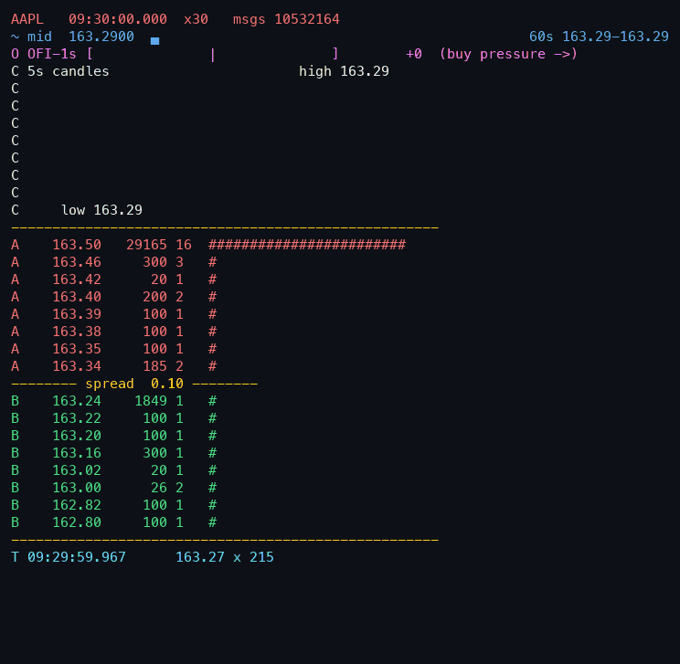

# nasdaq-itch-lob

A C++ feed handler for **raw Nasdaq TotalView-ITCH 5.0** binary data — full-day
parse, limit-order-book reconstruction, validation against the stream's own
ground truth, and an ML layer (XGBoost) built on the book's output. No LOBSTER,
no FI-2010, no pre-processed datasets: the input is the exchange's binary wire
format, ~370–420M messages per day.



*Replay dashboard (`itch-replay`): midprice sparkline and live 1 s
order-flow-imbalance gauge (the ML layer's main feature), 5 s candlesticks with
a buy/sell volume profile on a shared price axis, the price ladder, and a trade
tape with aggressor direction — gray `·` prints are hidden-order executions
inside the spread, whose aggressor is unknowable from the feed.*

## Measured results

All numbers below are produced by the commands in **Reproduce**; none are
estimates. Hardware: Apple M4 (10 cores, 16 GB RAM), macOS, Apple clang 17,
`-O3`; the hot path is **single-threaded**. Day 01/30/2019: 368,366,634
messages, 11.2 GB decompressed (streamed — never written to disk).

| Metric | Value | Command |
|---|---|---|
| Throughput, end-to-end (incl. gzip inflate) | **20.2 M msg/s** | `itch-parse bench` (median of 3) |
| Throughput, parse + book update only | **55.8 M msg/s** | `itch-parse bench` (median of 3) |
| Per-message latency, mean | **17.9 ns** | derived: parse+book time / messages |
| Per-message latency, p50 | **< 42 ns** (below timer tick) | `itch-parse latency` |
| Per-message latency, p99 / p99.9 | **291 ns / 1.04 µs** | `itch-parse latency` |
| Execution match rate (both days) | **100.000000 %** (492,275 + 273,503 execs) | `itch-parse export` → `validation.json` |
| Modify match rate (both days) | **100.000000 %** (5.37 M + 5.73 M msgs) | same |
| Crossed-book instants in regular session | **0** (all 8 symbols, both days) | same |
| Closing cross vs official close | **16/16 exact to the cent** | `scripts/check_closes.py` |
| Midprice model, out-of-sample R² (1 s horizon) | **0.0017** pooled, 0.001–0.045 per symbol | `ml/midprice.py` |
| Fill-probability model, out-of-sample AUC | **0.740** (queue+distance logistic baseline: 0.725) | `ml/fills.py` |

Latency = `Handler::on_message` (field decode + dispatch + book update),
excluding stream inflation; distribution measured per message over all 368 M.
The Apple Silicon counter ticks at 24 MHz (41.7 ns), so p50 sits below one
tick; the mean comes from the unthrottled aggregate. Timer overhead is
reported by the tool, never subtracted.

## What it does

- **Parses all 23 ITCH 5.0 message types** from the official spec — add,
  add-with-MPID, execute, execute-with-price, cancel, delete, replace, trade,
  cross, system events, and the administrative set. Field offsets transcribed
  from Nasdaq's spec PDF, framing verified byte-by-byte (2-byte big-endian
  length prefix per message in the historical files, unlike the live feed's
  MoldUDP64). Unknown type or wrong length = hard error, not a skip.
- **Reconstructs price-level books** for 8 liquid symbols (AAPL MSFT AMZN NVDA
  AMD INTC FB TSLA) while parsing every message on the wire — the
  keep-books-for-what-you-trade pattern real handlers use; memory stays
  bounded via locate-code filtering at add time.
- **Validates against the stream itself**: every execution/cancel/delete/replace
  must apply cleanly to the reconstructed book (order present, shares
  sufficient, price consistent). The Nasdaq closing cross *is* the official
  close for Nasdaq-listed names, giving an exact external check — 16/16 across
  both days. Venue volume vs consolidated tape is reported as a ratio
  (19–37 %) because Nasdaq is one venue among ~16; an exact match is
  impossible by construction.
- **Exports the book's own output for ML**: L5 snapshots on every top-of-book
  change (~7.4 M/day) and a lifecycle record for every resting order near the
  touch (~3.5 M/day) with its fate — filled, cancelled, replaced, or alive at
  close — read directly off the stream. That labeling is the L3-only part:
  with price-level (L2) data you never learn an individual order's outcome.

## ML results, honestly stated

**Midprice (weak, expectedly).** Order-flow-imbalance features (Cont, Kukanov
& Stoikov 2014) at 100 ms/1 s/5 s plus book shape, sampled every 500 ms,
predicting the 1 s mid change. Trained on 01/30/2019, tested on 03/27/2019.
Out-of-sample R² = **0.0017** pooled; per-symbol 0.0012 (AMZN) to 0.045
(INTC) — higher for cheap, tick-constrained names, the pattern the OFI
literature predicts. This weakness was pre-registered in the plan before
training: R² near 0.001 at this horizon is the honest norm, and anything
above 0.05 would have been treated as leakage and hunted, not reported.

**Fill probability (the interesting half).** P(fill ≥ 1 share) for a resting
order given its queue position at insertion. Test-day AUC **0.740** vs 0.725
for a logistic baseline on queue position + distance alone; feature
importances rank distance-from-touch, queue depth, and order size first, as
they should. Calibration is monotone but over-confident at high predicted
probabilities — the base fill rate halved between train day (10.3 %, an FOMC
session) and test day (6.0 %), a real regime shift reported rather than
tuned away. Plots: `docs/assets/fill_model.png`,
`docs/assets/midprice_importance.png`.

## Reproduce

```sh
scripts/get_spec.sh                      # official spec PDF (not committed)
scripts/get_day.sh 01302019              # ~4.8 GB from emi.nasdaq.com
scripts/get_day.sh 03272019              # ~5.0 GB
make all && make test                    # zero C++ deps beyond system zlib

./build/itch-parse bench   data/01302019.NASDAQ_ITCH50.gz    # throughput
./build/itch-parse latency data/01302019.NASDAQ_ITCH50.gz    # latency dist
./build/itch-parse export  data/01302019.NASDAQ_ITCH50.gz data/exports/01302019
./build/itch-parse export  data/03272019.NASDAQ_ITCH50.gz data/exports/03272019
python3 scripts/check_closes.py data/exports/01302019/validation.json

python3 -m venv .venv && .venv/bin/pip install -r ml/requirements.txt
brew install libomp                      # OpenMP runtime for the xgboost wheel
.venv/bin/python ml/midprice.py data/exports/01302019 data/exports/03272019
.venv/bin/python ml/fills.py    data/exports/01302019 data/exports/03272019
```

Or `scripts/run_all.sh` for the whole sequence (~30 min download + ~10 min
compute). The replay demo (entirely separate from the benchmarks):

```sh
./build/itch-replay data/01302019.NASDAQ_ITCH50.gz AAPL --speed 60 --start 09:30:00 --duration 23400
```

Flags: `--speed N` (replay rate multiple), `--duration SEC` of market time
(23400 = full 09:30–16:00 session), `--candle SEC` (candle interval),
`--depth N` (ladder levels per side). The dashboard is ~30 rows; use a tall
terminal window.

## Design notes

- Single-threaded hot path: chunked zlib inflate → framing → switch dispatch →
  book update. Throughput is measured both end-to-end and with inflate time
  excluded (timed per 8 MB chunk), and both are reported.
- Price levels are sorted vectors, best-at-front: activity clusters at the
  touch, so linear scans beat tree maps on real data. Order store is
  `std::unordered_map` (day-unique u64 refs), tracked symbols only.
- Replace = delete + fresh add under the new reference, inheriting side/symbol
  from the original per spec §1.4.5; non-printable executions are excluded
  from volume to avoid double counting the cross prints.
- The validation gate ran before any ML: a book that doesn't reconcile makes
  every downstream number meaningless.

## Limitations

- **Single venue.** Nasdaq is a minority of total US equity volume; the other
  ~15 exchanges plus off-exchange flow are invisible here. Nasdaq-venue share
  of the tracked names measured 19–37 % on these days.
- **Sample dates are month-end** (Nasdaq's free sample days), so they may be
  atypical sessions; 01/30/2019 was additionally an FOMC day.
- One train day, one test day, 8 symbols. Fill-model calibration visibly
  degrades under the day-over-day fill-rate shift; more days would be the
  first improvement.
- Historical-file framing (2-byte length prefix), not the live feed's
  MoldUDP64/SoupBinTCP transport; no gap/heartbeat handling.
- Hidden (non-displayed) liquidity appears only when it executes (P messages);
  the reconstructed book is the displayed book.
- Replaced orders are dropped from the fill sample (continuation ambiguous);
  orders alive at EOD count as unfilled.
- Replay pacing is sleep-based and coarse — it is a demo, and it is never the
  thing being benchmarked.

## Layout

```
src/        messages.hpp reader book handler hist itch_parse itch_replay
tests/      book_test.cpp — scripted sequences with known outcomes
ml/         loaders ofi midprice fills (+ requirements.txt)
scripts/    get_day get_spec check_closes render_gif run_all
docs/       DECISIONS.md, plans/, assets/
```
